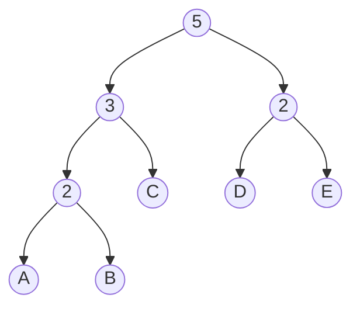
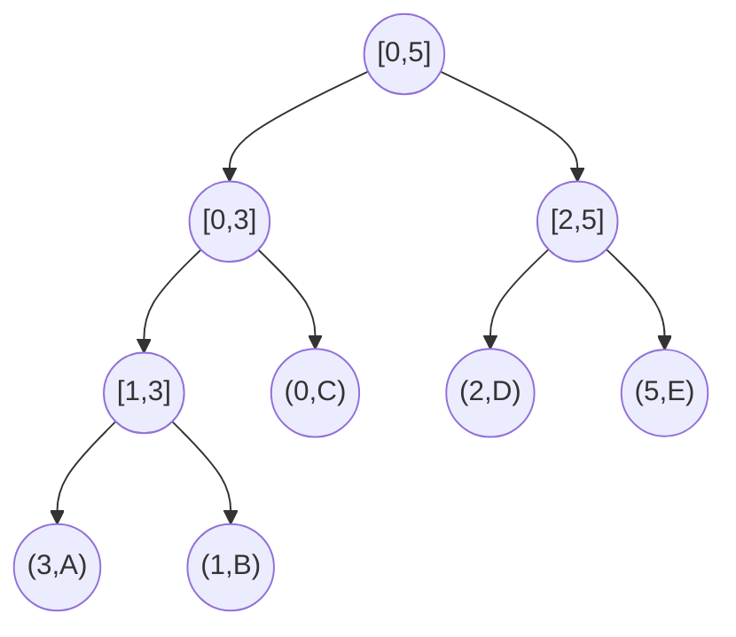

[](https://classroom.github.com/a/bUO2CABJ)
# Haskell: Monoidal trees


<details>
<summary>Guidelines</summary>

## Guidelines

When solving the homework, strive to create not just code that works, but code that is readable and concise.
Try to write small functions which perform just a single task, and then combine those smaller
pieces to create more complex functions.

Don’t repeat yourself: write one function for each logical task, and reuse functions as necessary.

Don't be afraid to introduce new functions where you see fit.

### Sources

Each task has corresponding source file in [src](src) directory where you should implement the solution.

### Building

All solutions should compile without warnings with following command:

```bash
stack build
```

### Testing

You can and should run automated tests before pushing solution to GitHub via

```bash
stack test --test-arguments "-p TaskX"
```

where `X` in `TaskX` should be number of corresponding Task to be tested.

So to run all test for the first task you should use following command:

```bash
stack test --test-arguments "-p Task1"
```

You can also run tests for all tasks with just

```bash
stack test
```

### Debugging

For debugging you should use GHCi via stack:

```bash
stack ghci
```

You can then load your solution for particular task using `:load TaskX` command.

Here is how to load Task1 in GHCi:

```bash
$ stack ghci
ghci> :load Task1
[1 of 1] Compiling Task1 ( .../src/Task1.hs, interpreted )
Ok, one module loaded.
```

> **Note:** if you updated solution, it can be quickly reloaded in the same GHCi session with `:reload` command
> ```bash
> ghci> :reload
> ```

</details>

## Preface

In this assignment you will gradually implement a general-purpose tree-based data structure
that can be specialized using monoid annotations to support efficient random-access sequences,
priority queues and much more.

> It is recommended for tasks to be implemented in order.

## Task 1 (3 points)

The nodes in the trees that you will be implementing will be annotated with additional
information in the form of some monoid value.

### Measure

In order to facilitate such annotation in [src/Task1.hs](src/Task1.hs) you will find
following type class along with some basic example instances:

```haskell
-- | Class describing values 'a' that can be measured as monoid 'm'
class Monoid m => Measured m a where
  -- | Returns corresponding measure 'm' for given value 'a'
  measure :: a -> m
```

We will be calling annotations *measures* and something that can be annotated with
particular monoid as *measured*.

### Monoids

Your first task is to prepare necessary monoid instances that you will be using later
and provide a way to measure with each monoid:

- ```haskell
  data Min a = PosInf | Min a
  ```
  - Monoid: $\langle S \cup \\{+\infty\\}, +\infty, min \rangle$
  - Measure: `measure x = Min x`
  
  **Example:**

  ```haskell
  >>> measure "bar" :: Min Char
  Min 'a'
  >>> measure [True] :: Min Bool
  Min True
  >>> measure ([] :: [Int]) :: Min Int
  PosInf
  ```

- ```haskell
  data Max a = NegInf | Max a
  ```
  - Monoid: $\langle S \cup \\{-\infty\\}, -\infty, max \rangle$
  - Measure: `measure x = Max x`
  
  **Example:**

  ```haskell
  >>> measure "bar" :: Max Char
  Max 'r'
  >>> measure [True] :: Max Bool
  Max True
  >>> measure ([] :: [Int]) :: Max Int
  NegInf
  ```

- ```haskell
  newtype MinMax a = MinMax { getMinMax :: (Min a, Max a) }
  ```
  - Monoid: $\langle S \cup \\{+\infty\\}, +\infty, min \rangle \times \langle S \cup \\{-\infty\\}, -\infty, max \rangle$
  - Measure: `measure x = MinMax (Min x, Max x)`
  
  **Example:**

  ```haskell
  >>> measure "foo" :: MinMax Char
  MinMax {getMinMax = (Min 'f',Max 'o')}
  >>> measure [True] :: MinMax Bool
  MinMax {getMinMax = (Min True,Max True)}
  >>> measure ([] :: [Int]) :: MinMax Int
  MinMax {getMinMax = (PosInf,NegInf)}
  ```

- ```haskell
  data Size a = Size { getSize :: Int }
  ```
  - Monoid: $\langle S, 0, + \rangle$
  - Measure: `measure x = Size 1`
  
  **Example:**

  ```haskell
  >>> measure "bar" :: Size Char
  Size {getSize = 3}
  >>> measure [True] :: Size Bool
  Size {getSize = 1}
  >>> measure ([] :: [Int]) :: Size Int
  Size {getSize = 0}
  ```

## Task 2 (3 points)

Now you will implement your first monoidal tree and use it
to build random-access sequence and priority queue.

### Binary tree

The definition for this tree is already provided in [src/Task2/Tree.hs](src/Task2/Tree.hs):

```haskell
-- | Binary tree with values 'a' in leaves
-- Intermediate branches contain only accumulated measure 'm'
data Tree m a
  = Empty
  | Leaf a
  | Branch m (Tree m a) (Tree m a)
  deriving (Show, Eq)
```

As you can see, the values in this binary tree are located at the leaves
and intermediate branches contain only accumulated measure from subtrees.

You will need to implement instances of `Measured` and `Foldable` for this tree.

#### Smart constructors

In order to simplify work with tree and avoid forgetting to accumulate measure
when creating a new branch, it is a good practice to extract this measure maintenance logic
into *smart constructors*:

- ```haskell
  leaf :: a -> Tree m a
  ```
- ```haskell
  branch :: Measured m a => Tree m a -> Tree m a -> Tree m a
  ```

> [!NOTE]
>
> The `leaf` constructor might seem redundant, but it is useful to have a unified interface
> for constructing tree.

#### Monoidal tree instance

Next you should implement a public interface for your binary tree as `MonoidalTree` instance.

This `MonoidalTree` class is located at [src/Common/MonoidalTree.hs](src/Common/MonoidalTree.hs)
and will be re-used in subsequent tasks with different trees as a base.

This class `MonoidalTree t` contains three methods:

- ```haskell
  toTree :: (Foldable f, Measured m a) => f a -> t m a
  ```
  which converts given `Foldable` container to a tree.

  > **Note:** the order should be consistent with `toList` from `Foldable` instance that
  > you implemented previously.
  >
  > In other words the following property should hold:
  >
  > ```haskell
  > toList . toTree == id
  > ```

- ```haskell
  (<|) :: Measured m a => a -> t m a -> t m a
  ```
  which prepends given value to a tree

- ```haskell
  (|>) :: Measured m a => t m a -> a -> t m a
  ```
  which appends given value to a tree

Your job is to implement this instance for binary tree in [src/Task2/Tree.hs](src/Task2/Tree.hs).

> [!TIP]
>
> For now we are not concerned with balancing of this tree,
> so both prepend and append can be implemented in the simplest way
> with $O(1)$ complexity.

### Random-access sequence

Now using previously implemented monoidal binary tree you can use this tree to implement
random-access sequence with $O(log(n))$ indexing into this sequence on average.

The trick is to use `Size` monoid from the first task. Measuring tree elements with
this monoid will get you effectively *cached* number of elements for each branch:



Using this cached information you can reach leaf at any given index by simply descending
into corresponding branch, which will contain the required index.

> [!TIP]
>
> This approach is very similar to how search works in binary search trees.

#### Definition

In [src/Task2/Seq.hs](src/Task2/Seq.hs) you will find following wrapper definition around binary tree:

```haskell
-- | Random-access sequence based on binary tree
newtype Seq a = Seq { getTree :: Tree (Size a) (Elem a) }
  deriving (Show, Eq)
```

Each element is additionally wrapped into `Elem` wrapper in case we require any additional
constraints on element type and to streamline `Measured` instance implementation for compiler.

```haskell
-- | Sequence element wrapper
newtype Elem a = Elem { getElem :: a }
  deriving (Show, Eq)
```

Your goal is to implement `Measured` instance for `Elem` using `Size` monoid and `Foldable` instance
for `Seq`.

In particular, caching size of each subtree allows efficient $O(1)$ implementation of `length` method
from `Foldable`, which you should make sure to implement.

#### Sequence instance

Next, similar to binary tree, you should implement a public interface for your sequence as `Sequence` instance.

This `Sequence` class is located at [src/Common/Sequence.hs](src/Common/Sequence.hs)
and will be re-used in subsequent tasks with different trees as a base.

This class `Sequence s` contains several methods:

- ```haskell
  empty :: s a
  ```
  which simply constructs empty sequence

- ```haskell
  toSequence :: Foldable f => f a -> s a
  ```
  which converts given `Foldable` container to a sequence.

  > **Note:** the order should be consistent with `toList` from `Foldable` instance that
  > you implemented previously.
  >
  > In other words the following property should hold:
  >
  > ```haskell
  > toList . toSequence == id
  > ```

- ```haskell
  (+|) :: a -> s a -> s a
  ```
  which prepends given element to sequence

- ```haskell
  (|+) :: s a -> a -> s a
  ```
  which appends given element to sequence

- ```haskell
  insertAt :: Int -> a -> s a -> s a
  ```
  which inserts given element into specified position in sequence

- ```haskell
  removeAt :: Int -> s a -> s a
  ```
  which removes element at specified position in sequence

- ```haskell
  elemAt :: Int -> s a -> Maybe a
  ```
  which returns element at specified position in sequence
  if it exists wrapped into `Just` or `Nothing` otherwise

Your job is to implement this instance for `Seq` in [src/Task2/Seq.hs](src/Task2/Seq.hs).

> [!IMPORTANT]
>
> Methods `insertAt`, `removeAt` and `elemAt` should be implemented efficiently
> with $O(log(n))$ complexity as discussed previously.

### Priority queue

Now you will see how just by using a different monoid you can turn monoidal binary tree
into full on priority queue with $O(log(n))$ access to both highest and lowest priority element on average.

This time you will be using `MinMax` monoid from the first task. Measuring tree elements with
this monoid will get you effectively *cached* minimum and maximum elements for each branch
(leaves contain a pair `(k, v)` where `k` is priority of corresponding value `v`):



Using this cached information you can reach leaf with highest or lowest priority
by simply descending into corresponding branch, which will contain needed (higher or lower) priority.

> [!TIP]
>
> This approach is again very similar to how search works in binary search trees.

#### Definition

In [src/Task2/PQueue.hs](src/Task2/PQueue.hs) you will find following wrapper definition around binary tree:

```haskell
-- | Priority queue based on binary tree
newtype PQueue k v = PQueue { getTree :: Tree (MinMax k) (Entry k v) }
  deriving (Show, Eq)
```

Each pair of priority `k` and value `v` is additionally wrapped into `Entry` wrapper in case we require any additional
constraints on element type and to streamline `Measured` instance implementation for compiler.

```haskell
-- | Priority queue entry wrapper
newtype Entry k v = Entry { getEntry :: (k, v) }
  deriving (Show, Eq)
```

Your goal is to implement `Measured` instance for `Entry` using `MinMax` monoid.

> [!NOTE]
>
> No `Foldable` instance necessary this time, but you can implement it if you want to.

#### Priority queue instance

Next, similar to binary tree and random-access sequence, you should implement a public interface
for your queue as `PriorityQueue` instance.

This `PriorityQueue` class is located at [src/Common/PriorityQueue.hs](src/Common/PriorityQueue.hs)
and will be re-used in subsequent tasks with different trees as a base.

This class `PriorityQueue q` contains several methods:

- ```haskell
  empty :: q k v
  ```
  which simply constructs empty queue

- ```haskell
  toPriorityQueue :: (Foldable f, Ord k) => f (k, v) -> q k v
  ```
  which converts given `Foldable` of pairs into to priority queue.

- ```haskell
  entries :: q k v -> [(k, v)]
  ```
  which returns queue elements paired with their priority

- ```haskell
  insert :: Ord k => k -> v -> q k v -> q k v
  ```
  which inserts given value with priority into queue

- ```haskell
  extractMin :: Ord k => q k v -> Maybe (v, q k v)
  ```
  which returns value with lowest priority paired with queue
  without that element wrapped into `Just` if such element exists (non-empty queue),
  or returns `Nothing` otherwise

- ```haskell
  extractMax :: Ord k => q k v -> Maybe (v, q k v)
  ```
  which returns value with highest priority paired with queue
  without that element wrapped into `Just` if such element exists (non-empty queue),
  or returns `Nothing` otherwise

Your job is to implement this instance for `PQueue` in [src/Task2/PQueue.hs](src/Task2/PQueue.hs).

> [!IMPORTANT]
>
> Methods `insert`, `extractMin` and `extractMax` should be implemented efficiently
> with $O(log(n))$ complexity as discussed previously.

## Task 3 (2 points)

Now that you are familiar with overall idea of monoidal trees and how to use them,
next step is to improve asymptotic complexity of tree operations. The most relevant operations
for random-access sequence and priority queues that you implemented are bound by the
depth of the leaves.

There are many ways to ensure consistent depth of the leaves in binary tree by balancing it
(like [AVL tree](https://en.wikipedia.org/wiki/AVL_tree)
or [Red-black tree](https://en.wikipedia.org/wiki/Red%E2%80%93black_tree)).
However, in this task your goal will be to implement a balanced monoidal
[2-3 tree](https://en.wikipedia.org/wiki/2%E2%80%933_tree) as base tree representation for
random-access sequence and priority queue.

### 2-3 tree

#### Definition

The definition for the tree is already provided in [src/Task3/Tree.hs](src/Task3/Tree.hs):

```haskell
-- | 2-3 tree with values 'a' in leaves
-- Intermediate nodes contain only accumulated measure 'm'
data Tree m a
  = Empty
  | Leaf a
  | Node2 m (Tree m a) (Tree m a)
  | Node3 m (Tree m a) (Tree m a) (Tree m a)
  deriving (Show, Eq)
```

Like previously, you will need to implement instances of `Measured` and `Foldable` for this tree.

#### Smart constructors

Similarly, you should implement *smart constructors* for 2-3 tree, which will handle
measure maintenance and accumulation:

- ```haskell
  leaf :: a -> Tree m a
  ```
- ```haskell
  node2 :: Measured m a => Tree m a -> Tree m a -> Tree m a
  ```
- ```haskell
  node3 :: Measured m a => Tree m a -> Tree m a -> Tree m a -> Tree m a
  ```

#### Balancing

In order to keep worst case complexity of $O(log(n))$ your 2-3 tree must remain *balanced* during
all operations like insertion or removal of element from the tree by maintaining following *path-length invariant*:

> All leaves in the tree must have the same depth from the root.

This invariant ensures that path length from root to any leaf is no more than $log(n)$, which is exactly the path
that all of insertion, removal and lookup operations traverse for both random-access sequence and priority queue.

Both insertion and removal from 2-3 tree can be split into two distinct steps:

- downward phase, which finds location for insertion or removal respectively, and
- upward phase, which must restore balance in case it is gets broken by insertion or removal

Downward phase should be intuitive to implement. However, restoring balance in upward phase is more involved.
Instead of going into more details about balancing for both insertion and removal,
I will refer you to excellent lecture materials
of [CS230 Data Structures](https://www.cs.princeton.edu/~dpw/courses/cos326-12/ass/2-3-trees.pdf) course.

Below are also some tips for implementation in Haskell in case you get stuck.

> [!TIP]
>
> In upward phases of both insertion and removal you need to track additional information,
> besides the branch that you just modified.
>
> Do not be afraid to **introduce custom helper data types** that will help you
> track all necessary information during upward phase.
> Even if this data type will be used only for insertion or only for removal, it is ok.
> The closer data type corresponds to the problem that you are trying to solve -- the better.
>
> It is also always useful to introduce helper functions that handle one particular part of a more complex one.

#### Monoidal tree instance

Next you should implement a public interface for your binary tree as `MonoidalTree` instance.

> [!IMPORTANT]
>
> Unlike binary tree where it was possible to implement prepending and appending naively with $O(1)$ complexity,
> our 2-3 tree must remain balanced, so these operations become $O(log(n))$ in worst case.

### Random-access sequence and priority queue

Now once again you need implement random-access sequence in [src/Task3/Seq.hs](src/Task3/Seq.hs)
and priority queue in [src/Task3/PQueue.hs](src/Task3/PQueue.hs) using 2-3 monoidal tree.

## Task 4 (2 points)

Lastly, one remaining issue that appeared with 2-3 tree compared to naive binary tree is
that complexity of prepend and append operations have degraded from $O(1)$ to $O(log(n))$.

However, there is a modification of 2-3 tree that achieves amortized $O(1)$ access to
both ends of the tree (including prepending and appending elements), while keeping $O(log(n))$
for other regular operations.

This structure is called [Finger tree](https://en.wikipedia.org/wiki/Finger_tree) and can be
obtained from regular 2-3 tree as follows:

> 
>
> Shows a [2–3 tree](https://en.wikipedia.org/wiki/2%E2%80%933_tree) (top) can be pulled up into a finger tree (bottom)
>
> [Wikipedia](https://en.wikipedia.org/wiki/Finger_tree#Transforming_a_tree_into_a_finger_tree)

More [examples](https://www.staff.city.ac.uk/~ross/papers/FingerTree/more-trees.html) illustrating
this tree are available on the [website](https://www.staff.city.ac.uk/~ross/papers/FingerTree.html)
of authors who developed this structure. In fact, original [paper](https://www.staff.city.ac.uk/~ross/papers/FingerTree.pdf)
is also available on this website.

> [!NOTE]
>
> This exact finger tree is the basis for highly efficient implementation for sequences in Haskell in
> [Data.Sequence](https://hackage.haskell.org/package/containers/docs/Data-Sequence.html) and can also be
> used independently via [fingertree](https://hackage.haskell.org/package/fingertree) package maintained by original authors.

> [!IMPORTANT]
>
> I strongly suggest you to read the original [paper](https://www.staff.city.ac.uk/~ross/papers/FingerTree.pdf)
> and follow along while implementing your solution for this task. This data structure is quite complicated,
> so having a reference implementation from the paper will be incredibly useful.

### Finger tree

#### Definition

The definition for the tree is already provided in [src/Task4/Tree.hs](src/Task4/Tree.hs):

```haskell
-- | Finger tree with values 'a' in leaves
-- Intermediate branches contain only accumulated measure 'm'
data Tree m a
  = Empty
  | Single a
  | Deep m (Digit a) (Tree m (Node m a)) (Digit a)
  deriving (Show, Eq)

-- | 2-3 node of finger tree
data Node m a
  = Node2 m a a
  | Node3 m a a a
  deriving (Show, Eq)

-- | Finger tree digit
data Digit a
  = One   a
  | Two   a a
  | Three a a a
  | Four  a a a a
  deriving (Show, Eq)
```

As you can see, it has non-regular structure comprising several data types in `Tree`, `Node` and `Digit`.
This approach enforces inherent balance of the tree, so basically no explicit balancing is required during
implementation of operations, just ensuring that the resulting order of elements in the tree is correct.

Like always, you will need to implement instances of `Measured` and `Foldable` for all involved data types.

#### Smart constructors

As before, you should implement *smart constructors* for finger tree, which will handle
measure maintenance and accumulation:

- ```haskell
  single :: a -> Tree m a
  ```
- ```haskell
  node2 :: Measured m a => a -> a -> Tree m a
  ```
- ```haskell
  node3 :: Measured m a => a -> a -> a -> Tree m a
  ```
- ```haskell
  deep :: Measured m a => Digit a -> Tree m (Node m a) -> Digit a -> Tree m a
  ```

#### Monoidal tree instance

Next you should implement a public interface for your binary tree as `MonoidalTree` instance.

> [!IMPORTANT]
>
> Once again, I strongly encourage you to read the original [paper](https://www.staff.city.ac.uk/~ross/papers/FingerTree.pdf)
> and follow their approach to implementation.
>
> You will find some of essential utility functions from the paper defined
> in the bottom of [src/Task4/Tree.hs](src/Task4/Tree.hs) file.

### Random-access sequence and priority queue

Now for the last time you need implement random-access sequence in [src/Task4/Seq.hs](src/Task4/Seq.hs)
and priority queue in [src/Task4/PQueue.hs](src/Task4/PQueue.hs) using ultimate data structure -- finger tree.

